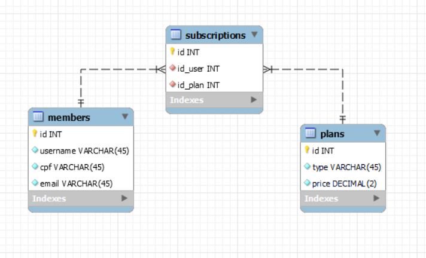

<p align="center">
<a href=https://github.com/insper-classroom/23-2-md-proj-sql-marombainsper target="_blank">
<!--  
-->
Maromba Insper microservice
</a>
</p>

<p align="center">


</p>

<p></p>
<p></p>

## 🔍 Table of Contents

- [🔍 Table of Contents](#-table-of-contents)
- [📝 Diagram EER](#-diagram-eer)
- [🎥 Video](#-video)
- [💻 Stack](#-stack)
- [📝 Project Summary](#-project-summary)
- [⚙️ Setting Up](#️-setting-up)
    - [Your Environment Variable](#your-environment-variable)
- [🚀 Run Locally](#-run-locally)
- [🙌 Contributors](#-contributors)

## 📝 Diagram EER

First, let's check our diagram for this project:



## 🎥 Video

Check out our video demonstration of first part of the project on YouTube:

[](https://www.youtube.com/watch?v=q_znljYrwo8)


## 💻 Stack

- [fastapi](https://fastapi.tiangolo.com/): FastAPI is a modern, fast (high-performance) web framework for building APIs with Python 3.7+.
- [pydantic](https://pydantic-docs.helpmanual.io/): Pydantic is a runtime data validation and parsing library for Python, which will use Python type annotations.
- [SQLAlchemy](https://www.sqlalchemy.org/): SQLAlchemy is a SQL toolkit and Object-Relational Mapping (ORM) library for Python.
- [starlette](https://www.starlette.io/): Starlette is a lightweight ASGI framework/toolkit, which is ideal for building high-performance asynchronous services.
- [uvicorn](https://www.uvicorn.org/): Uvicorn is a fast ASGI server implementation, which is used to run Python web applications.
- [websockets](https://websockets.readthedocs.io/): Websockets is a library for building WebSocket servers and clients in Python, which provides a simple and convenient API for building real-time applications.
- [python-dotenv](https://github.com/theskumar/python-dotenv): python-dotenv is a library that reads the key-value pair from a .env file and adds them to the environment variables.
- [click](https://click.palletsprojects.com/): Click is a Python package for creating command-line interfaces, which simplifies the process of writing command-line tools.

## 📝 Project Summary

- [**app**](app): Main directory containing the core functionalities and components of the Python project.
- [**app/members**](app/members): Handles the management and operations related to project members.
- [**app/plans**](app/plans): Deals with the creation and management of different plans available in the project.
- [**app/subscribe**](app/subscribe): Handles the subscription-related functionalities and operations.

## ⚙️ Setting Up

#### Your Environment Variable

Create local .env file on root, with the variables. Example can be found on `.env.example`.

**YOU NEED TO CREATE YOUR DATABASE BEFORE MANUALLY, AND IT MUST HAVE THE SAME NAME AS DEFINED ON `DB_NAME` VARIABLE**

## 🚀 Run Locally
1.Clone the 23-2-md-proj-sql-marombainsper repository:
```sh
git clone https://github.com/insper-classroom/23-2-md-proj-sql-marombainsper
```
2.Install the dependencies with one of the package managers listed below:
```bash
pip install -r requirements.txt
```
3.Initialize database
```
invoke seed-db
```
4.Start the development mode:
```bash
uvicorn wsgi:app --reload
```

## 🙌 Contributors

<table style="border:1px solid #404040;text-align:center;width:100%">
<tr><td style="width:14.29%;border:1px solid #404040;">
        <a href="https://github.com/xValentim" spellcheck="false">
          
          <br />
          <b>xValentim</b>
        </a>
        <br />
        <a href="https://github.com/insper-classroom/23-2-md-proj-sql-marombainsper/commits?author=xValentim" title="Contributions" spellcheck="false">
          4 contributions
        </a>
      </td><td style="width:14.29%;border:1px solid #404040;">
        <a href="https://github.com/andrebrito16" spellcheck="false">
          
          <br />
          <b>andrebrito16</b>
        </a>
        <br />
        <a href="https://github.com/insper-classroom/23-2-md-proj-sql-marombainsper/commits?author=andrebrito16" title="Contributions" spellcheck="false">
          2 contributions
        </a>
      </td></table>

